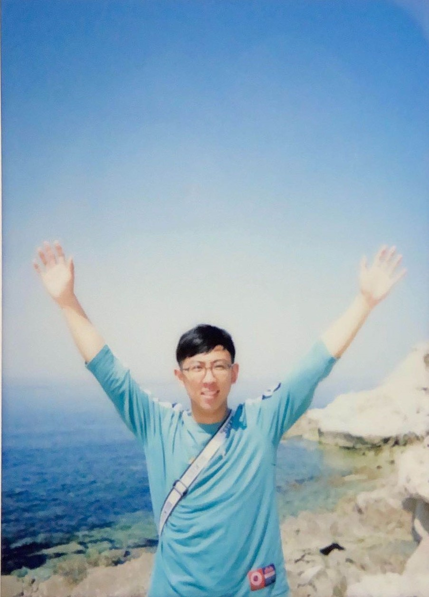

 
# About Me

    

I am Yiran Lei, a final-year Master student at Department of Computer Science and Technology, Tsinghua University, advised by [Prof. Mingwei Xu](http://routing.netlab.edu.cn/tiki-index.php?page=Mingwei+Xu). I received my B.Eng. degree in School of Software, Tsinghua University in 2020. 

I am motivated to develop new mechanisms and systems in real networks for finer measurement, control, optimization, and new applications. My research interests include network measurement, programmable data planes, and smart systems.

    

    

    

        
I am applying for Ph.D starting in 2023. Ready to explore directions not limited to programmable data planes.

        
Currently in Seattle. Happy to chat!

    

# News
* Sep. 2022: Visit Professor [Arvind Krishnamurthy](https://www.cs.washington.edu/people/faculty/arvind) @ University of Washington.
* Aug. 2022: Attend [SIGCOMM 2022](https://conferences.sigcomm.org/sigcomm/2022/venue.html) in person! 
* May. 2022: *PrintQueue* accepted in [SIGCOMM 2022](https://conferences.sigcomm.org/sigcomm/2022/program.html).
* Oct. 2021: Awarded Tsinghua Hefei Talent Scholarship.
* Aug. 2021: *DOVE* accepted in [ICNP 2021](https://icnp21.cs.ucr.edu/program.html).

# Publications
* **PrintQueue: Performance Diagnosis via Queue Measurement in the Data Plane**  
  *Yiran Lei*, [Liangcheng Yu](https://liangchengyu.com/), [Vincent Liu](https://vincen.tl/publications.html), [Mingwei Xu](http://routing.netlab.edu.cn/tiki-index.php?page=Mingwei+Xu)  
  SIGCOMM, Aug 2022, 55/279=19.7%  
  [[Paper]](https://dl.acm.org/doi/10.1145/3544216.3544257)[[Slides]](/assets/papers/PrintQueue/PrintQueue_v0.98.pdf)[[Artifact]](https://github.com/A-Dying-Pig/PrintQueue)  
   <em>Artifacts Available</em> <em>Artifacts Functional</em> <em>Results Reproduced</em>   

* **DOVE: Diagnosis-driven SLO Violation Detection** 
  *Yiran Lei*, [Yu Zhou](https://zhouyu-sunny.github.io/), Yunsenxiao Lin, [Mingwei Xu](http://routing.netlab.edu.cn/tiki-index.php?page=Mingwei+Xu), Yangyang Wang  
  ICNP, Nov 2021, 38/154=24.7%  
  [[Paper]](https://ieeexplore.ieee.org/document/9651986) [[Slides]](/assets/papers/DOVE/DOVE.pdf) [[Code-Tofino]](https://gitlab.com/A-Dying-Pig/dove) [[Code-BMv2]](https://gitlab.com/A-Dying-Pig/dove-bmv2)
  

    

        
Teaser Video

        <iframe width="400" height="225" src="https://www.youtube.com/embed/hDGp2wkwsf0" frameborder="0" allowfullscreen></iframe>
    

    

        
Talk Video

        <iframe width="400" height="225" src="https://www.youtube.com/embed/opzT5JAfrt8" frameborder="0" allowfullscreen></iframe>
    

  

  

# Teaching
### Teaching Assistant
* *The Principle of Computer Network*, 2021 Fall, Department of Computer Science and Technology, Tsinghua University

# Blogs
* A [tutorial](https://www.yiranlei.com/P4_Installation_Tutorial) to install P4 and its dependencies step by step. [Tofino](https://www.yiranlei.com/sde_tip).
* A [tutorial](https://www.yiranlei.com/DPDK_Installation_Tutorial) to install DPDK and DPDK-Pktgen, highlighting steps that need extra attention.
